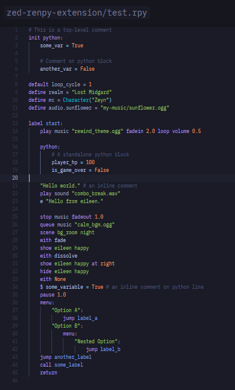

# zed-renpy-extension
> [!NOTE]
> Current version: v0.3.0 | Grammar Repository: [zeynthedev/tree-sitter-renpy](https://github.com/ZeynTheDev/tree-sitter-renpy) | [Full Changelog](changelog.md)

An approach to rewrite Ren'Py's Visual Studio Code extension to a Zed extension.

## Usage
This repository provides a Zed extension that enriches the Ren'Py programming experience. If you are looking for the Tree-sitter grammar engine utilized by this extension, please visit:
[tree-sitter-renpy](https://github.com/ZeynTheDev/tree-sitter-renpy).

## Development
To test it locally:
1. Download the repository as `.zip`.
2. Extract the folder and load it into Zed as a local extension.

## How To Test It?

```
# This is a top-level comment
init python:
    some_var = True

    # Comment on python block
    another_var = False

default loop_cycle = 1
define realm = "Lost Midgard"
define mc = Character("Zeyn")
define audio.sunflower = "my-music/sunflower.ogg"

label start:
    play music "rewind_theme.ogg" fadein 2.0 loop volume 0.5

    python:
        # A standalone python block
        player_hp = 100
        is_game_over = False

    "Hello world." # an inline comment
    play sound "combo_break.wav"
    e "Hello from eileen."

    stop music fadeout 1.0
    queue music "calm_bgm.ogg"
    scene bg_room night
    with fade
    show eileen happy
    with dissolve
    show eileen happy at right
    hide eileen happy
    with None
    $ some_variable = True # an inline comment on python line
    pause 1.0
    menu:
        "Option A":
            jump label_a
        "Option B":
            menu:
                "Nested Option":
                    jump label_b
    jump another_label
    call some_label
    return
```

It should look exactly like the screenshot below (some differences may occur due to different Zed themes):  


## Current Extension Scale
This extension is currently capable of providing syntax highlighting and structural indentation for the core elements of Ren'Py visual novels.

| Category  | Supported Elements  | Description |
|-----------|---------------------|-------------|
| Story Flow  | `label`, `jump`, `call`, `return`, `pause`, `menu`, `say` | Core narration, branching, and deep block nesting for choices. |
| Visual Management  | `scene`, `show`, `hide`, `with`  | Backgrounds, sprites, transforms (`at`), and transitions (`None`). |
| Audio Controls  | `play`, `stop`, `queue` |Music/sound management with inline modifiers (e.g., `fadein`, `loop`).|
| State & Data  | `define`, `default`  | Variable and character declarations, including namespace dot-notation.|
| Python Integration  | `python:`, `init python:`, `$`  | Full native Python syntax injection via Zed. |
| Editor Tooling  | Auto-indentation  | Smart indentation triggers after colons (`:`) in blocks.  | 

## Changelog
### Added
- **Python Language Injection:** Embedded Python blocks (`python:`, `init python:`, and inline `$`) are now fully injected with Zed's native Python syntax highlighting (correctly coloring `True`, `False`, numbers, and variables).
- Syntax highlighting for multi-word image names (e.g., `show eileen happy`).
- Syntax highlighting for transform properties (e.g., the `at` keyword and `right` property).
- Function highlighting for label identifiers in `jump` and `call` statements.
- Keyword highlighting for the `python` keyword in `init python` statements.
- Auto-indentation support for nested `menu_choice` blocks.

### Known Issues
- GUI and layout blocks are not yet parsed (`screen`, `style`, `transform`, `image`).
- **Partial Syntax Coverage:** The extension currently covers the core visual novel flow but does not yet cover the entirety of the [official Ren'Py documentation](https://www.renpy.org/doc/html/). Full syntax support will be implemented in incremental phases.

---------------
> [!NOTE]
> Please be wary before using this project since this project is heavily AI influenced—the repository owner is still learning on C and tree-sitter topic.
