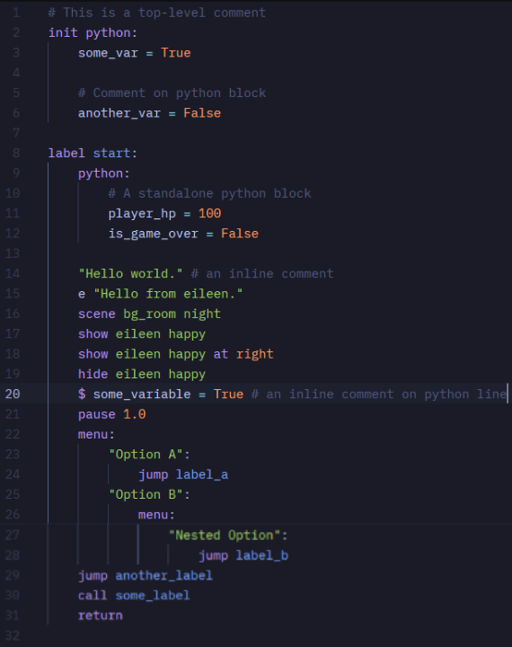

# zed-renpy-extension
> [!NOTE]
> Current version: v0.2.0 | Grammar Repository: [zeynthedev/tree-sitter-renpy](https://github.com/ZeynTheDev/tree-sitter-renpy) | [Full Changelog](changelog.md)

An approach to rewrite Ren'Py's Visual Studio Code extension to a Zed extension.

## How To Test It?
Try make a simple Ren'Py file (`.rpy`) then write it down:
```
# This is a comment
init python:
    some_var = True

label start:
    "Hello world."
    e "Hello from eileen."
    scene bg_room
    show eileen_happy
    hide eileen
    $ some_variable = True
    pause 1.0
    menu:
        "Option A":
            jump label_a
        "Option B":
            jump label_b
    jump another_label
    call some_label
    return
```
It should look exactly like the screenshot below:


## Current Extension Scale
This extension is currently capable of providing syntax highlighting and structural indentation for the core elements of Ren'Py visual novels. As of v0.2.0, it reliably supports:

- **Story Flow & Dialogue:** Syntax highlighting for `label`, `jump`, `call`, `return`, `pause`, and narrator/character `say` statements.
- **Visual Management:** Parsing for `scene`, `show`, and `hide` statements, including support for multi-word image identifiers and transform properties (e.g., `at right`).
- **Native Python Injection:** Embedded Python blocks (`python:`, `init python:`) and inline Python lines `($`) are fully injected with Zed's native Python syntax highlighting.
- **Deep Block Nesting:** Accurate indent-based parsing for multi-level `menu` choices and embedded logic.
- **Smart Editor Tooling:** Auto-indentation triggers upon pressing enter after colons (`:`) in labels, menus, and Python blocks.

## Changelog
### Added
- **Python Language Injection:** Embedded Python blocks (`python:`, `init python:`, and inline `$`) are now fully injected with Zed's native Python syntax highlighting (correctly coloring `True`, `False`, numbers, and variables).
- Syntax highlighting for multi-word image names (e.g., `show eileen happy`).
- Syntax highlighting for transform properties (e.g., the `at` keyword and `right` property).
- Function highlighting for label identifiers in `jump` and `call` statements.
- Keyword highlighting for the `python` keyword in `init python` statements.
- Auto-indentation support for nested `menu_choice` blocks.

### Fixed
- Updated underlying [tree-sitter-renpy](https://github.com/ZeynTheDev/tree-sitter-renpy) to v0.2.0, which introduces a custom C scanner for robust indent/dedent handling.
- Menu blocks and their contents are no longer opaque; nested statements inside menus are now structurally parsed and indented correctly.

### Known Limitations (Planned for v0.3.0)
- Missing syntax highlighting for variable declaration statements (`define`, `default`).
- Missing syntax highlighting for audio control statements (`play`, `stop`, `queue`).
- GUI and layout blocks (`screen`, `style`, `transform`, `image`) are not yet parsed or highlighted.
- Transition statements (`with`) are not yet explicitly mapped.

---------------
> [!NOTE]
> Please be wary before using this project since this project is heavily AI influenced—the repository owner is still learning on C and tree-sitter topic.
