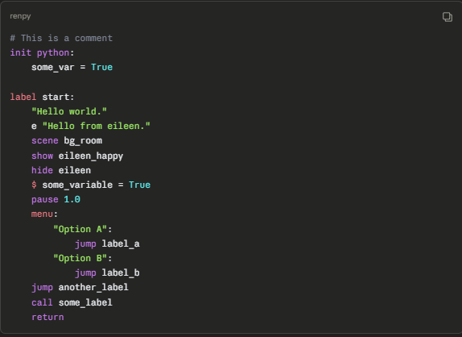
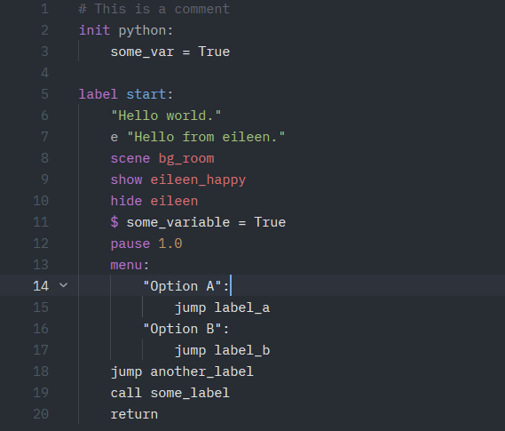

# zed-renpy-extension
> [!NOTE]
> Current version: v0.1.0 | Grammar Repository: [zeynthedev/tree-sitter-renpy](https://github.com/ZeynTheDev/tree-sitter-renpy) | [Full Changelog](changelog.md)

An approach to rewrite Ren'Py's Visual Studio Code extension to a Zed extension.

## How To Test It?
Try make a simple Ren'Py file (`.rpy`) then write it down:
```
# This is a comment
init python:
    some_var = True

label start:
    "Hello world."
    e "Hello from eileen."
    scene bg_room
    show eileen_happy
    hide eileen
    $ some_variable = True
    pause 1.0
    menu:
        "Option A":
            jump label_a
        "Option B":
            jump label_b
    jump another_label
    call some_label
    return
```
The ideal condition should be as how it shown below:


## Current Extension Scale


As shown above, current version (`v0.1.0`) works as how it listed here.

### Working Correctly

| Command/Keyword  | Color |
| ------------- | ------------- |
| Comments  | Gray  |
| `label`  | Purple  |
| `scene`  | Purple  |
| `show`  | Purple  |
| `hide`  | Purple  |
| `menu`  | Purple  |
| `pause`  | Purple  |
| `init`  | Purple  |
| label names  | Blue  |
| Strings | Green  |
| Image Names  | Red  |
| numbers  | Orange  |
| `$`  | Purple  |

### Expected Limitations
| Limitation Expected  | Reason of Limitation |
| ------------- | ------------- |
| Menu block contents will be colored white. | Currently it made to be treated as opaque `indented_block`  |
| `some_var=True` will be colored white.  | Currently Python contents made to be treated as opaque and needs v0.2.0 external scanner  |
| `True/False` not colored  | Same reason, it's inside opaque block  |

I'll try my best to fix it asap :3

## Changelog

### Added
- Basic syntax highlighting for Ren'Py (`.rpy`, `.rpyc`, `.rpym`, `.rpymc`)
- Keyword highlighting (`label`, `jump`, `call`, `return`, `menu`, 
  `scene`, `show`, `hide`, `pause`, `init`, `python`)
- String highlighting for dialogue and narrator lines
- Comment highlighting (`#`)
- Number highlighting
- Character name highlighting in say statements
- Image name highlighting in scene/show/hide statements
- Inline Python (`$`) keyword highlighting
- Auto-indentation after `:` in label, menu, python, and init blocks
- Powered by [tree-sitter-renpy](https://github.com/ZeynTheDev/tree-sitter-renpy)

### Known Limitations
- Menu block contents are not individually highlighted due to
  opaque block parsing. Planned fix in v0.2.0.
- Embedded Python blocks (`python:`, `init python:`) contents
  are not highlighted. Requires external scanner (v0.2.0).
- Multi-word image names (`show eileen happy`) are not supported.
  Use underscored names (`show eileen_happy`) as a workaround.
- `True`, `False`, `None` inside Python blocks are not highlighted.
